# CloudLabs Features

## Getting Started

1. On the Lab page, you will have the lab environment on the right side. To access the Lab environment select **ACCESS LAB**.

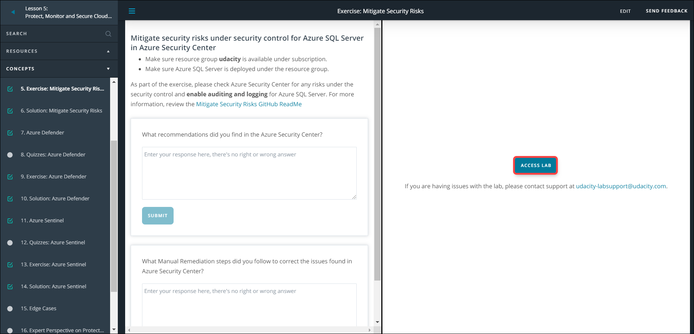

2. The lab environment will start preparing and it will show you the estimated time of your deployment.

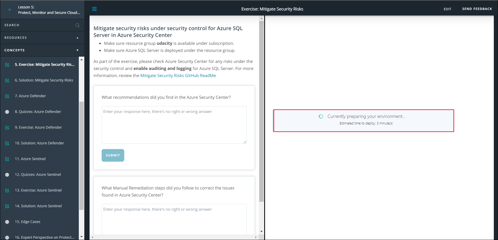

3. You can hide the left navigation pane by clicking on **collapsed menu icon**(the one with three horizontal bars).

4. Once the lab environment is ready, you will have a host virtual machine which you will be using throughout to perform the lab.

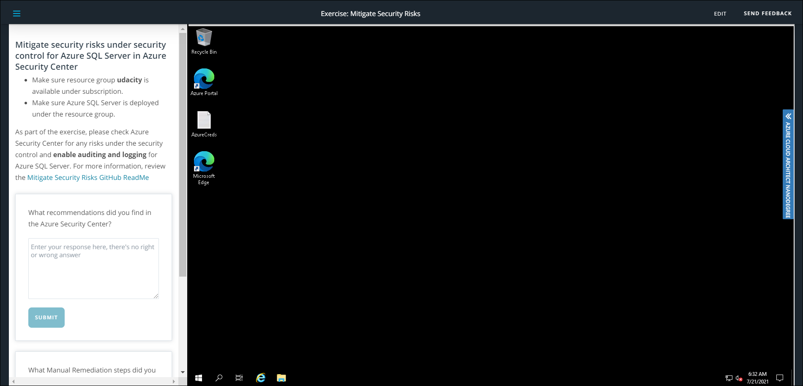

5. You have a slide button on the right side of the screen, select it to view the lab guide.

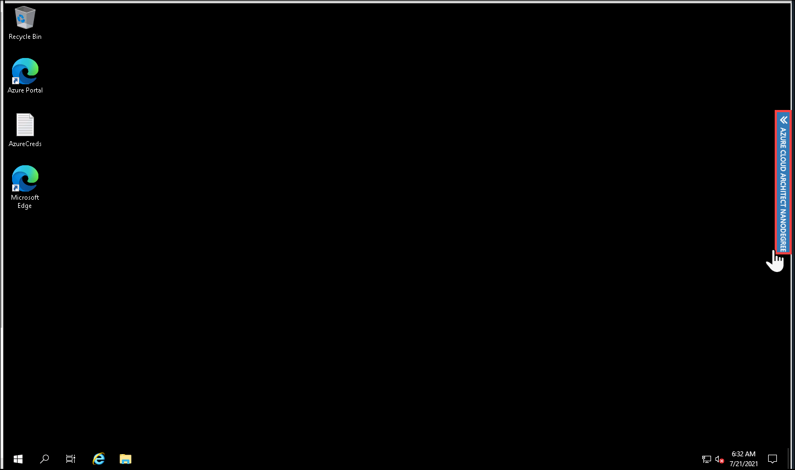

6. Here you have three tabs - **Lab Guide, Lab Environment** and **Help**. The **Lab Guide** tab has instructions in it that should be followed in order to successfully complete the lab.

7. Next you have **Lab Environment** tab in which you have **Environment Details** section, where you can find details such as _Login credentials for your User_, _VM login credentials_.

8. In **Lab Environment** tab, you have another section that is **Lab Resources**. In this section, you will have the following items:
* All those virtual machines listed which are present in your lab environment
* Status of the VM as if it's running or deallocated.
* Three action buttons - 
      **1. Refresh:** Select this button to refresh the page and see the latest status of the Virtual Machines.
      **2. Start:** Select this button to start all the Virtual Machines at the same time.
      **3. Stop:** Select this button to de-allocate all the Virtual Machines at the same time.

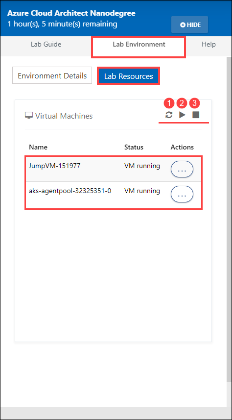

9. In case you want to perform an action on a specific Virtual Machine, then from **Actions** select the **ellipses(...)** given against the desired Virtual Machine. You will have **Start, Stop and Restart** as your options, select the required action.

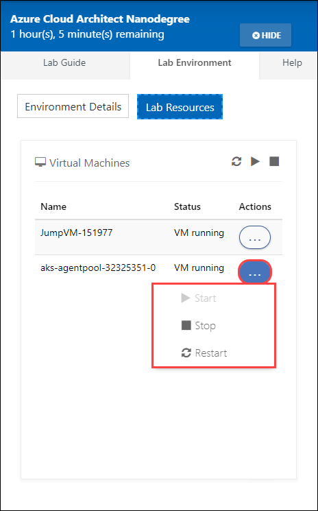

10. At last, you have **Help** tab where we have listed known issues such as Unable to copy paste, Need credentials and much more. In case if you face any of these issues, you can troubleshoot it by following the insturctions given there.

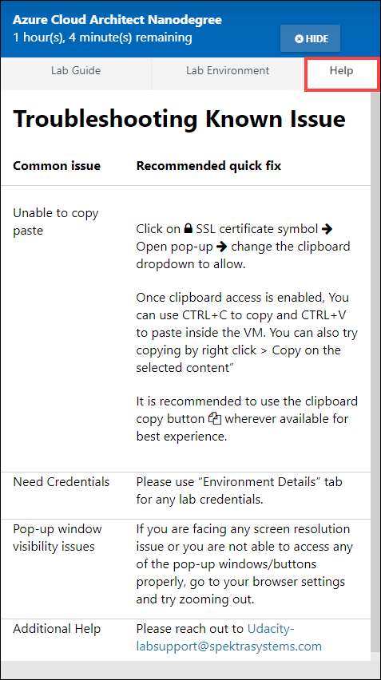

11. Hide the Lab guide

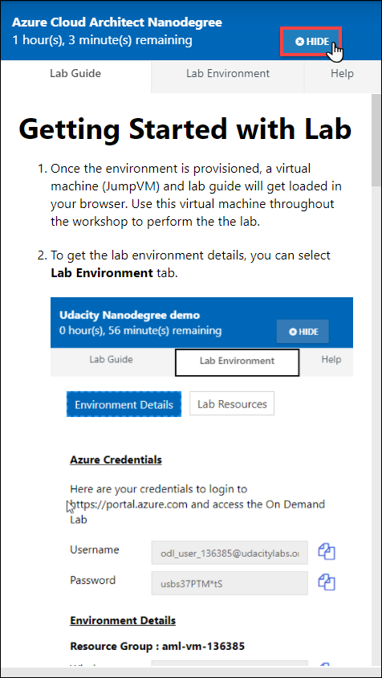

### Enable Attendee Tracking & Time Out Operation

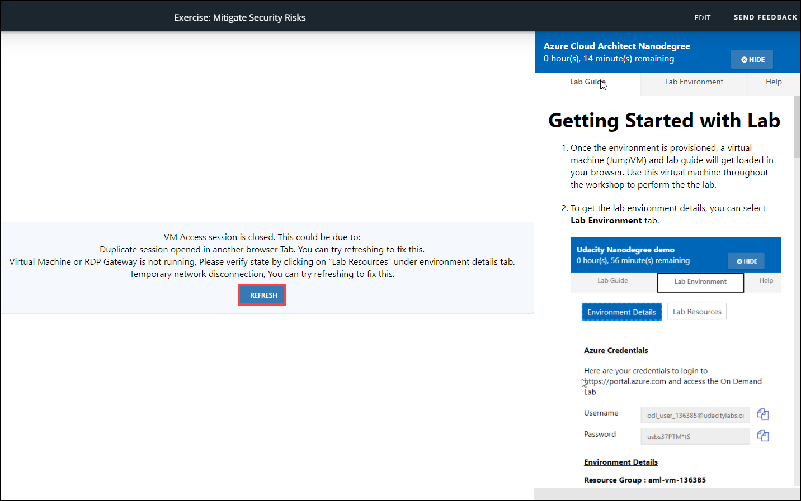

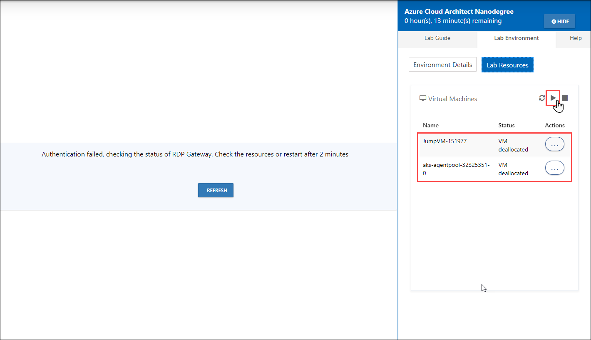

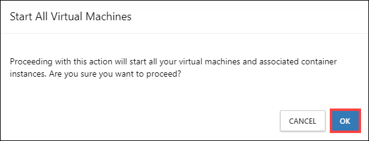

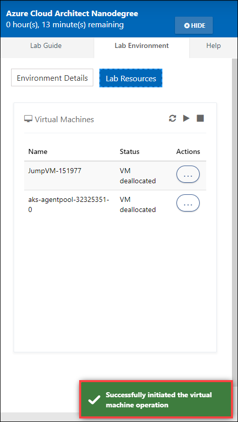

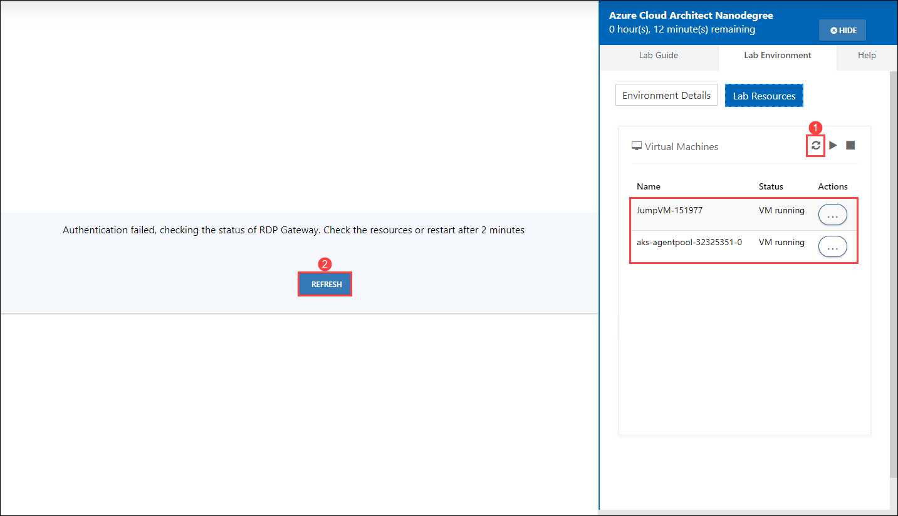

Allow User to Extend lab

if enabled u get - Max Limit of Duration Extension by User (Minutes) 

Enable Hot Instances 
if enabled u get - Optimize Host Instances VM Cost 

Delay Time (in Minutes)  Minimum Available Instances  Limit Hot Instance Life    Hot Instance Life Time (Minutes) 

------------------
Enable Attendee Tracking 
if enabled u get - Environment Idle Timeout (in Mins)

Time Out Operation - Resoucre stop or Delete Environment

