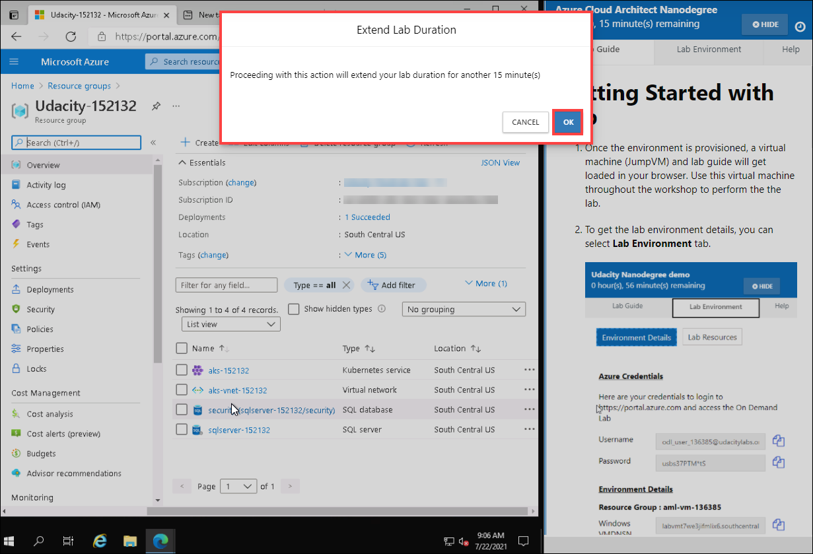

# CloudLabs Features

## Getting Started

1. On the Lab page, you will have the lab environment on the right side. To access the Lab environment select **ACCESS LAB**.

2. The lab environment will start the deployment process and will give you an estimated time for completion.

3. You can hide the left navigation pane by clicking on **collapsed menu icon**(the one with three horizontal bars).

4. Once the lab environment is ready, you will have a host virtual machine, you will be using this throughout to perform the labs.

5. You have a slide button on the right side of the screen, click on it to view the lab guide.

6. Here you have three tabs - **Lab Guide, Lab Environment**, and **Help**. The **Lab Guide** tab section contains various information related to the lab, typically containing multiple pages of information. You will need this information throughout the course of the labs.

7. Next you have the **Lab Environment** tab in which you have **Environment Details** section, where you can find details such as _Login credentials for your User_, _VM login credentials_.

8. In the **Lab Environment** tab, you have a sub-section that is called **Lab Resources**. In this section, you will have the following information:
* All the Virtual Machines listed which are present in your lab environment
* Status of the Virtual Machine as if it's running or deallocated.
* Three action buttons: 
      
     * **(1) Refresh:** Select this button to refresh the page and see the latest status of the Virtual Machines.
      
     * **(2) Start:** Select this button to start all the Virtual Machines at the same time.
      
     * **(3) Stop:** Select this button to de-allocate all the Virtual Machines at the same time.

9. In case you want to act on a specific Virtual Machine, then from **Actions** select the **ellipses(...)** icon. Here you will have the options to **Start, Stop and Restart** the VMs as and when required.

10. The **Help** section covers some of the most common issues and their troubleshooting steps that can be performed by the learner. It is recommended to through the Help section before contacting the instructor or CloudLabs Support team for help, as it will save valuable time.

11. You can also hide the Lab guide by selecting **Hide** button from top-right corner of the lab guide. 

12. It will take you back to the very first interface where you had the host virtual machine. 

## CloudLabs Features

In this section we will learn about the following features offered by CloudLabs:

1. Enable Attendee Tracking
2. Enable Hot Instances 
3. Allow User to Extend lab

Let's see how each of the features work:

**1. Enable Attendee Tracking:** This feature helps to track user's activity in their lab environment and perform certain actions termed as **Time Out Operation**. The operations are listed below:

* **Resource Stop -** Virtual machines will be stopped.
* **Delete Environment -** Lab environment will be deleted.

In case a user is inactive in the lab environment for a particular period, then as per the configurations of the environment, one of the above-mentioned operations will be imposed on that user's environment. The time of inactivity by a user is termed as **Environment Idle Timeout** that will be configured in minutes.

From here we will learn more about the feature with the help of an example. 

1. Let's say we have a user **User01** and he has:
* **Environment Idle Timeout** set to **10 minutes** 
* **Time Out Operation** set to **Resource Stop**

2. User01 is performing the lab, then he takes a break which means his environment will be idle till he starts again. So as per the **Environment Idle Timeout**, once he reaches the inactivity time limit(i.e., 10 minutes), all the resources of his environment will stop of as **Time out operation** was set to **Resource Stop**.

3. Once User01 is back, he will have a note similar to the image shown below. It will say that **RDP Gateway is not running** which means your host VM is in a stopped state.

4. Now to continue the lab, User01 should start his VM again by navigating to **Lan Environment** tab **> Lab Resources.** You can see all the VMs are in the deallocated state. So, select the **Start** button to start them all.

5. Select **OK** on the popup asking you to confirm - **Start All Virtual Machines**.

6. Once the process starts, you will get a heads-up in the bottom-right corner of the guide saying **Successfully initiated the virtual machine operation**.

7. Select **Refresh** button to view the updated status of the VMs. Once the VMs are back into running state, User01 will select **Refresh** button on the screen and the host VM will launch for him.

**2. Enable Hot Instances:** Hot instance is a lab environment that is deployed and made available sometime before a workshop begins.

 * For an actual workshop, we deploy hot instances depending on the projected user count. Those many instances will be made available 30 minutes before the Workshop Start Time.

* Next, when a user will register, the hot instance(i.e., the pre-deployed lab environment) will get allocated to instantly which results in **Zero wait time for users**. As soon they launch the lab, they will get the lab environment. Following is a representation of how a lab environment launches without any waiting time for users.

* This feature reduces risk or any kind of deployment issues. In case there's an issue, it can be fixed in advance as they are deployed earlier from the Workshop time.

* **Optimize Hot Instances VM Cost:** This feature works in a way where as soon as hot instances are ready, it shutdowns the resources to optimize the cost. A **Delay time** is provided here, say 5 minutes. So once the hot instances are ready, it will wait for 5 minutes and then stop the resources.

* **Limit Hot Instance Life:** In this feature, duration is set up to delete the hot instances. Once the duration is exhausted, a hot instance will delete. This feature is used to avoid having unused hot instances.

  Let's say, for a workshop we have a user count less than expected, so we will end up with unused hot instances. In this case, this feature will act according to the duration set up in it, such as we set up 60 minutes. Therefore, if a hot instance is not allocated to a user for 60 minutes, it will automatically get deleted.

**3. Allow User to Extend lab:** This feature helps a user to extend the duration of their lab environment. One can set up the limit of duration extension for a user, this duration will be added up with their actual lab duration.

* For example, a user is performing a lab with a lab duration of 60 minutes. Now using this feature, a duration of 30 minutes set up. 
      
     * When the user will be left with 15 minutes, he will get a popup message asking him if he wants to extend his lab for 15 minutes. In case a user is not done with the lab, he can opt-in to extend the duration by selecting **OK** on the popup message.
     
     
 
     * The popup will come on a gap of 15 minutes each. 
     * As we had a limit of 30 minutes, the user will get the extension popup twice that makes 15 minutes + 15 minutes = 30 minutes i.e., total extension limit.

     

     * This way, user will have 90 minutes in total to perform the lab.

