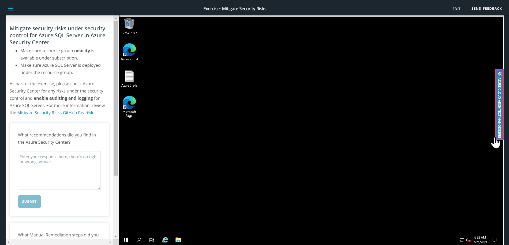
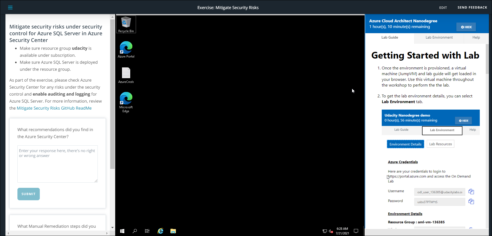

# CloudLabs Features

## Getting Started

1. 

2. 

3. 

4. 

5. 

6. 

7. 

8. 

9. 

Allow User to Extend lab

if enabled u get - Max Limit of Duration Extension by User (Minutes) 

Enable Hot Instances 
if enabled u get - Optimize Host Instances VM Cost 

Delay Time (in Minutes)  Minimum Available Instances  Limit Hot Instance Life    Hot Instance Life Time (Minutes) 

Enable Attendee Tracking 
if enabled u get - Environment Idle Timeout (in Mins)

Time Out Operation - Resoucre stop or Delete Environment

